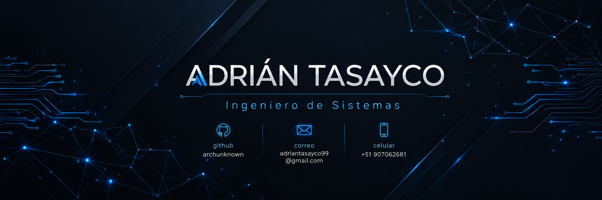

<div align="center">
  
</div>


<br>

[](https://linkedin.com/in/adriantasayco/)
[](https://www.instagram.com/depor.adrian/)
[](mailto:adriantasayco99@gmail.com)


</div>

---

## `$ whoami`

```yaml
name        : Adrian T.
role        : Systems Engineering Student
location    : 🌎 South America
focus       : Web · Mobile · Data Analytics
mindset     : "Ship it. Learn from it. Improve it."
currently   : Building full-stack systems with Laravel + Vue.js
open_to     : Collaboration · Internships · Open Source
```

> *I thrive at the intersection of clean code, smart architecture, and meaningful user experiences.*  
> *Every project is a chance to push boundaries and leave something better than I found it.*

---

## `$ ls -la /skills`

<table>
<tr>
<td valign="top" width="50%">

### 🎨 Frontend


### ⚙️ Backend & APIs


### 📱 Mobile


</td>
<td valign="top" width="50%">

### 🗄️ Databases


### 🛠️ Tools & DevOps


### 💻 OS


</td>
</tr>
</table>

---

## `$ git log --oneline`

<div align="center">


</div>

<div align="center">
  
</div>

---

## `$ cat /achievements`

<div align="center">
  
</div>

---

## `$ cat /roadmap.md`

```
2025 ──────────────────────────────────────────────────────────── 2026
  │                                                                 │
  ▼                                                                 ▼
[✓] Vue.js + Laravel     [✓] Flutter Mobile     [ ] Cloud & DevOps
[✓] SQL & Power BI       [~] REST API Design    [ ] System Design
[~] Kotlin Android       [ ] Docker & CI/CD     [ ] Open Source Contrib
```

---

<div align="center">

*"El código que escribes hoy es la infraestructura de alguien mañana."*  
*"The code you write today is someone's infrastructure tomorrow."*

⚡ **Always building. Always learning.**

</div>
